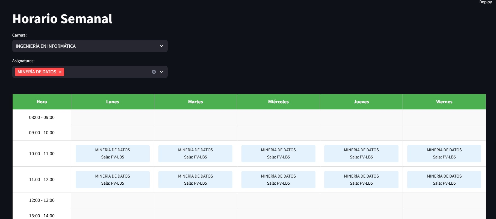

# Duoc-TAV-Visualizador
Visualizador interactivo para TAV

Este proyecto es un visualizador de horarios académicos desarrollado con Streamlit que permite a los estudiantes planificar su semestre de manera eficiente y visual.

## ⚙️ Funcionalidades

### 📋 Filtrado de Asignaturas
- Selección de carrera
- Selección múltiple de asignaturas
- Visualización dinámica de horarios

### 📅 Visualización del Horario
- Tabla semanal de lunes a viernes
- Horarios desde 8:00 hasta 21:00
- Bloques de clases con información detallada:
  - Nombre de la asignatura
  - Sala asignada
  - Profesor

### 📊 Información Detallada
- Tarjetas informativas por asignatura
- Detalles del profesor
- Número de sección
- Sala asignada

### 💾 Exportación
- Botón para capturar el horario
- Función de impresión para guardar como imagen

## 🛠️ Tecnologías Utilizadas
- Python 3.x
- Streamlit
- Pandas
- HTML/CSS para estilizado

## Estructura del CSV
El sistema espera un archivo CSV con la siguiente estructura:
- Carrera
- Asignatura
- Docente
- Sala
- Sección
- Horario (formato: "Día HH:MM:SS - HH:MM:SS")

## 🚀 Instalación y Uso

1. Clonar el repositorio:

2.- Instalar dependencias:

pip install streamlit pandas

3.- Ejecutar la aplicación:
streamlit run app.py